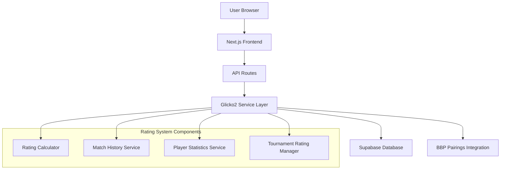

# Внедрение системы рейтингов Glicko2 для шахматной платформы

## 1. Обзор текущей архитектуры

### 1.1 Текущий стек технологий

* **Frontend**: Next.js 15.5.4 с React 19.1.0

* **Backend**: Supabase (PostgreSQL + Real-time + Auth)

* **Язык**: TypeScript

* **База данных**: PostgreSQL через Supabase

* **Аутентификация**: Telegram Web App

### 1.2 Существующие компоненты

* Таблицы: `users`, `tournaments`, `tournament_participants`, `rounds`, `matches`, `leaderboard`

* API endpoints для управления турнирами и матчами

* Система подсчета очков (победа: 1.0, ничья: 0.5, поражение: 0.0)

* Интеграция с BBP Pairings для жеребьевки

## 2. Анализ системы Glicko2

### 2.1 Основные принципы Glicko2

Система Glicko2, разработанная Марком Гликманом, улучшает классическую систему Эло:

* **Рейтинг (r)**: Основная оценка силы игрока

* **RD (Rating Deviation)**: Неопределенность в рейтинге

* **σ (sigma)**: Волатильность - степень непредсказуемости результатов

* **τ (tau)**: Системный параметр, контролирующий изменение волатильности

### 2.2 Преимущества для шахматной платформы

1. Более точная оценка силы новых игроков
2. Учет неопределенности в рейтингах
3. Адаптивная волатильность для нестабильных игроков
4. Быстрая конвергенция к истинной силе

## 3. Архитектура системы рейтингов

### 3.1 Диаграмма архитектуры



### 3.2 Компоненты системы

#### 3.2.1 Rating Calculator

* Вычисляет новые рейтинги по алгоритму Glicko2

* Управляет RD и волатильностью

* Обрабатывает периоды активности/неактивности

#### 3.2.2 Match History Service

* Сохраняет историю всех матчей

* Отслеживает изменения рейтингов

* Предоставляет статистику по игрокам

#### 3.2.3 Player Statistics Service

* Агрегирует статистику игроков

* Рассчитывает производительность в турнирах

* Управляет глобальными и турнирными рейтингами

#### 3.2.4 Tournament Rating Manager

* Управляет рейтингами в рамках турнира

* Координирует обновления после каждого раунда

* Обеспечивает консистентность данных

## 4. Структура базы данных

### 4.1 Модификации существующих таблиц

#### 4.1.1 Таблица users (расширение)

```sql
-- Добавляем поля для Glicko2 рейтинга
ALTER TABLE users ADD COLUMN glicko2_rating REAL DEFAULT 1500.0;
ALTER TABLE users ADD COLUMN glicko2_rd REAL DEFAULT 350.0;
ALTER TABLE users ADD COLUMN glicko2_volatility REAL DEFAULT 0.06;
ALTER TABLE users ADD COLUMN glicko2_last_game_date TIMESTAMPTZ;
ALTER TABLE users ADD COLUMN glicko2_games_period INTEGER DEFAULT 0;

-- Индексы для производительности
CREATE INDEX idx_users_glicko2_rating ON users(glicko2_rating);
CREATE INDEX idx_users_glicko2_rd ON users(glicko2_rd);
```

#### 4.1.2 Таблица tournaments (расширение)

```sql
-- Добавляем настройки для рейтинговой системы
ALTER TABLE tournaments ADD COLUMN rating_system TEXT DEFAULT 'glicko2';
ALTER TABLE tournaments ADD COLUMN use_global_ratings INTEGER DEFAULT 1;
ALTER TABLE tournaments ADD COLUMN rating_period_days INTEGER DEFAULT 7;
ALTER TABLE tournaments ADD COLUMN min_games_for_rating INTEGER DEFAULT 5;
```

### 4.2 Новые таблицы

#### 4.2.1 Таблица player\_ratings (история рейтингов)

```sql
CREATE TABLE player_ratings (
  id BIGSERIAL PRIMARY KEY,
  user_id BIGINT NOT NULL REFERENCES users(id) ON DELETE CASCADE,
  tournament_id BIGINT REFERENCES tournaments(id) ON DELETE CASCADE,
  rating_type TEXT NOT NULL DEFAULT 'glicko2', -- 'glicko2', 'fide', 'chesscom', 'lichess'
  rating REAL NOT NULL,
  rd REAL NOT NULL,
  volatility REAL NOT NULL,
  games_count INTEGER DEFAULT 0,
  period_start_date TIMESTAMPTZ NOT NULL,
  period_end_date TIMESTAMPTZ,
  created_at TIMESTAMPTZ DEFAULT NOW(),
  
  CONSTRAINT unique_user_tournament_period UNIQUE(user_id, tournament_id, rating_type, period_start_date)
);

-- Индексы
CREATE INDEX idx_player_ratings_user_id ON player_ratings(user_id);
CREATE INDEX idx_player_ratings_tournament_id ON player_ratings(tournament_id);
CREATE INDEX idx_player_ratings_rating_type ON player_ratings(rating_type);
CREATE INDEX idx_player_ratings_period ON player_ratings(period_start_date, period_end_date);
```

#### 4.2.2 Таблица rating\_periods (периоды рейтинга)

```sql
CREATE TABLE rating_periods (
  id BIGSERIAL PRIMARY KEY,
  tournament_id BIGINT REFERENCES tournaments(id) ON DELETE CASCADE,
  period_number INTEGER NOT NULL,
  start_date TIMESTAMPTZ NOT NULL,
  end_date TIMESTAMPTZ,
  status TEXT DEFAULT 'active', -- 'active', 'completed', 'archived'
  games_processed INTEGER DEFAULT 0,
  created_at TIMESTAMPTZ DEFAULT NOW(),
  
  CONSTRAINT unique_tournament_period UNIQUE(tournament_id, period_number)
);

CREATE INDEX idx_rating_periods_tournament ON rating_periods(tournament_id);
CREATE INDEX idx_rating_periods_status ON rating_periods(status);
```

#### 4.2.3 Таблица player\_performance (производительность игроков)

```sql
CREATE TABLE player_performance (
  id BIGSERIAL PRIMARY KEY,
  user_id BIGINT NOT NULL REFERENCES users(id) ON DELETE CASCADE,
  tournament_id BIGINT REFERENCES tournaments(id) ON DELETE CASCADE,
  games_played INTEGER DEFAULT 0,
  games_won INTEGER DEFAULT 0,
  games_drawn INTEGER DEFAULT 0,
  games_lost INTEGER DEFAULT 0,
  performance_rating REAL,
  opponents_average_rating REAL,
  streak_current INTEGER DEFAULT 0,
  streak_best INTEGER DEFAULT 0,
  last_game_result TEXT,
  last_game_date TIMESTAMPTZ,
  created_at TIMESTAMPTZ DEFAULT NOW(),
  updated_at TIMESTAMPTZ DEFAULT NOW(),
  
  CONSTRAINT unique_user_tournament_performance UNIQUE(user_id, tournament_id)
);

CREATE INDEX idx_player_performance_user ON player_performance(user_id);
CREATE INDEX idx_player_performance_tournament ON player_performance(tournament_id);
```

## 5. Интеграция библиотеки glicko2js

### 5.1 Установка и настройка

```bash
npm install glicko2js
npm install --save-dev @types/glicko2js
```

### 5.2 Создание Rating Service

```typescript
// lib/rating/glicko2-service.ts
import { Glicko2, Player, RatingPeriod } from 'glicko2js';

export interface Glicko2Config {
  tau: number;        // Системный параметр (обычно 0.5-1.2)
  rating: number;     // Начальный рейтинг
  rd: number;        // Начальное отклонение
  volatility: number; // Начальная волатильность
}

export interface RatingUpdate {
  userId: number;
  oldRating: number;
  oldRd: number;
  oldVolatility: number;
  newRating: number;
  newRd: number;
  newVolatility: number;
  gamesPlayed: number;
  periodStart: Date;
  periodEnd: Date;
}

export class Glicko2RatingService {
  private glicko2: Glicko2;
  
  constructor(private config: Glicko2Config = { tau: 0.5, rating: 1500, rd: 350, volatility: 0.06 }) {
    this.glicko2 = new Glicko2({
      tau: config.tau,
      rating: config.rating,
      rd: config.rd,
      vol: config.volatility
    });
  }

  /**
   * Рассчитать новые рейтинги для группы игроков
   */
  async calculateRatings(
    players: Array<{
      userId: number;
      rating: number;
      rd: number;
      volatility: number;
      opponents: Array<{
        userId: number;
        rating: number;
        rd: number;
        score: number; // 1 for win, 0.5 for draw, 0 for loss
      }>;
    }>
  ): Promise<RatingUpdate[]> {
    const updates: RatingUpdate[] = [];
    
    // Создаем Glicko2 игроков
    const glickoPlayers = new Map<number, Player>();
    const ratingPeriod = new RatingPeriod();
    
    players.forEach(player => {
      const glickoPlayer = this.glicko2.makePlayer(
        player.rating,
        player.rd,
        player.volatility
      );
      glickoPlayers.set(player.userId, glickoPlayer);
    });

    // Добавляем игры в рейтинговый период
    players.forEach(player => {
      const glickoPlayer = glickoPlayers.get(player.userId)!;
      
      player.opponents.forEach(opponent => {
        const glickoOpponent = glickoPlayers.get(opponent.userId)!;
        ratingPeriod.addGame(glickoPlayer, glickoOpponent, opponent.score);
      });
    });

    // Рассчитываем новые рейтинги
    this.glicko2.updateRatingPeriod(ratingPeriod);

    // Формируем результаты
    players.forEach(player => {
      const glickoPlayer = glickoPlayers.get(player.userId)!;
      const newRating = glickoPlayer.getRating();
      const newRd = glickoPlayer.getRd();
      const newVolatility = glickoPlayer.getVol();

      updates.push({
        userId: player.userId,
        oldRating: player.rating,
        oldRd: player.rd,
        oldVolatility: player.volatility,
        newRating,
        newRd,
        newVolatility,
        gamesPlayed: player.opponents.length,
        periodStart: new Date(),
        periodEnd: new Date()
      });
    });

    return updates;
  }

  /**
   * Рассчитать ожидаемый результат матча
   */
  calculateExpectedScore(playerRating: number, playerRd: number, opponentRating: number, opponentRd: number): number {
    const player = this.glicko2.makePlayer(playerRating, playerRd);
    const opponent = this.glicko2.makePlayer(opponentRating, opponentRd);
    
    return this.glicko2.predict(player, opponent);
  }

  /**
   * Определить, активен ли игрок (использовать ли RD конвергенцию)
   */
  isPlayerActive(lastGameDate: Date, currentDate: Date = new Date()): boolean {
    const daysSinceLastGame = (currentDate.getTime() - lastGameDate.getTime()) / (1000 * 60 * 60 * 24);
    return daysSinceLastGame <= 7; // Считаем активным, если играл за последнюю неделю
  }
}
```

## 6. API Endpoints для работы с рейтингами

### 6.1 Получение текущего рейтинга игрока

```typescript
// app/api/users/[id]/rating/route.ts
import { NextRequest, NextResponse } from 'next/server';
import { supabase } from '@/lib/supabase';

export async function GET(
  req: NextRequest,
  { params }: { params: { id: string } }
) {
  try {
    const userId = parseInt(params.id);
    if (isNaN(userId)) {
      return NextResponse.json({ error: 'Invalid user ID' }, { status: 400 });
    }

    const { data: user, error } = await supabase
      .from('users')
      .select('id, username, glicko2_rating, glicko2_rd, glicko2_volatility, glicko2_last_game_date')
      .eq('id', userId)
      .single();

    if (error || !user) {
      return NextResponse.json({ error: 'User not found' }, { status: 404 });
    }

    // Получаем статистику производительности
    const { data: performance } = await supabase
      .from('player_performance')
      .select('*')
      .eq('user_id', userId)
      .single();

    return NextResponse.json({
      user: {
        id: user.id,
        username: user.username,
        rating: user.glicko2_rating,
        rd: user.glicko2_rd,
        volatility: user.glicko2_volatility,
        lastGameDate: user.glicko2_last_game_date,
        confidenceInterval: {
          min: user.glicko2_rating - 2 * user.glicko2_rd,
          max: user.glicko2_rating + 2 * user.glicko2_rd
        }
      },
      performance: performance || null
    });
  } catch (error) {
    console.error('Error fetching user rating:', error);
    return NextResponse.json({ error: 'Internal server error' }, { status: 500 });
  }
}
```

### 6.2 Обновление рейтингов после матча

```typescript
// app/api/matches/[id]/update-ratings/route.ts
import { NextRequest, NextResponse } from 'next/server';
import { supabase } from '@/lib/supabase';
import { Glicko2RatingService } from '@/lib/rating/glicko2-service';

export async function POST(
  req: NextRequest,
  { params }: { params: { id: string } }
) {
  try {
    const matchId = parseInt(params.id);
    if (isNaN(matchId)) {
      return NextResponse.json({ error: 'Invalid match ID' }, { status: 400 });
    }

    // Получаем информацию о матче
    const { data: match, error: matchError } = await supabase
      .from('matches')
      .select(`
        *,
        white_player:tournament_participants!white_participant_id(*, user:users(*)),
        black_player:tournament_participants!black_participant_id(*, user:users(*)),
        round:rounds!round_id(*, tournament:tournaments!tournament_id(*))
      `)
      .eq('id', matchId)
      .single();

    if (matchError || !match) {
      return NextResponse.json({ error: 'Match not found' }, { status: 404 });
    }

    // Проверяем, что матч завершен
    if (match.result === 'not_played') {
      return NextResponse.json({ error: 'Match not completed' }, { status: 400 });
    }

    // Проверяем, не обновлялись ли уже рейтинги
    const { data: existingRatingUpdate } = await supabase
      .from('player_ratings')
      .select('id')
      .eq('match_id', matchId)
      .single();

    if (existingRatingUpdate) {
      return NextResponse.json({ error: 'Ratings already updated for this match' }, { status: 400 });
    }

    const ratingService = new Glicko2RatingService();
    
    // Подготавливаем данные для расчета
    const whitePlayer = {
      userId: match.white_player.user.id,
      rating: match.white_player.user.glicko2_rating,
      rd: match.white_player.user.glicko2_rd,
      volatility: match.white_player.user.glicko2_volatility,
      opponents: []
    };

    const blackPlayer = {
      userId: match.black_player.user.id,
      rating: match.black_player.user.glicko2_rating,
      rd: match.black_player.user.glicko2_rd,
      volatility: match.black_player.user.glicko2_volatility,
      opponents: []
    };

    // Определяем результат для каждого игрока
    let whiteScore: number;
    let blackScore: number;

    switch (match.result) {
      case 'white':
      case 'forfeit_black':
        whiteScore = 1;
        blackScore = 0;
        break;
      case 'black':
      case 'forfeit_white':
        whiteScore = 0;
        blackScore = 1;
        break;
      case 'draw':
        whiteScore = 0.5;
        blackScore = 0.5;
        break;
      default:
        return NextResponse.json({ error: 'Invalid match result' }, { status: 400 });
    }

    whitePlayer.opponents.push({
      userId: blackPlayer.userId,
      rating: blackPlayer.rating,
      rd: blackPlayer.rd,
      score: whiteScore
    });

    blackPlayer.opponents.push({
      userId: whitePlayer.userId,
      rating: whitePlayer.rating,
      rd: whitePlayer.rd,
      score: blackScore
    });

    // Рассчитываем новые рейтинги
    const updates = await ratingService.calculateRatings([whitePlayer, blackPlayer]);

    // Обновляем рейтинги в базе данных
    const updatedUsers = [];
    for (const update of updates) {
      const { error: updateError } = await supabase
        .from('users')
        .update({
          glicko2_rating: update.newRating,
          glicko2_rd: update.newRd,
          glicko2_volatility: update.newVolatility,
          glicko2_last_game_date: new Date().toISOString(),
          glicko2_games_period: (match.white_player.user.glicko2_games_period || 0) + 1
        })
        .eq('id', update.userId);

      if (updateError) {
        console.error('Error updating user rating:', updateError);
        continue;
      }

      // Сохраняем запись об обновлении рейтинга
      const { error: ratingError } = await supabase
        .from('player_ratings')
        .insert({
          user_id: update.userId,
          tournament_id: match.round.tournament.id,
          match_id: matchId,
          rating_type: 'glicko2',
          rating: update.newRating,
          rd: update.newRd,
          volatility: update.newVolatility,
          games_count: update.gamesPlayed,
          period_start_date: update.periodStart,
          period_end_date: update.periodEnd
        });

      if (ratingError) {
        console.error('Error recording rating update:', ratingError);
      }

      updatedUsers.push({
        userId: update.userId,
        oldRating: update.oldRating,
        newRating: update.newRating,
        ratingChange: update.newRating - update.oldRating
      });
    }

    // Обновляем статистику производительности
    await updatePlayerPerformance(match.white_player.user.id, match.round.tournament.id, whiteScore);
    await updatePlayerPerformance(match.black_player.user.id, match.round.tournament.id, blackScore);

    return NextResponse.json({
      success: true,
      updatedUsers,
      matchId
    });
  } catch (error) {
    console.error('Error updating match ratings:', error);
    return NextResponse.json({ error: 'Internal server error' }, { status: 500 });
  }
}

async function updatePlayerPerformance(userId: number, tournamentId: number, result: number): Promise<void> {
  // Логика обновления статистики производительности
  const { data: performance } = await supabase
    .from('player_performance')
    .select('*')
    .eq('user_id', userId)
    .eq('tournament_id', tournamentId)
    .single();

  if (performance) {
    const gamesPlayed = performance.games_played + 1;
    const gamesWon = performance.games_won + (result === 1 ? 1 : 0);
    const gamesDrawn = performance.games_drawn + (result === 0.5 ? 1 : 0);
    const gamesLost = performance.games_lost + (result === 0 ? 1 : 0);

    await supabase
      .from('player_performance')
      .update({
        games_played: gamesPlayed,
        games_won: gamesWon,
        games_drawn: gamesDrawn,
        games_lost: gamesLost,
        last_game_result: result === 1 ? 'win' : result === 0.5 ? 'draw' : 'loss',
        last_game_date: new Date().toISOString(),
        updated_at: new Date().toISOString()
      })
      .eq('id', performance.id);
  } else {
    await supabase
      .from('player_performance')
      .insert({
        user_id: userId,
        tournament_id: tournamentId,
        games_played: 1,
        games_won: result === 1 ? 1 : 0,
        games_drawn: result === 0.5 ? 1 : 0,
        games_lost: result === 0 ? 1 : 0,
        last_game_result: result === 1 ? 'win' : result === 0.5 ? 'draw' : 'loss',
        last_game_date: new Date().toISOString()
      });
  }
}
```

### 6.3 Получение рейтинговой статистики турнира

```typescript
// app/api/tournaments/[id]/ratings/route.ts
import { NextRequest, NextResponse } from 'next/server';
import { supabase } from '@/lib/supabase';

export async function GET(
  req: NextRequest,
  { params }: { params: { id: string } }
) {
  try {
    const tournamentId = parseInt(params.id);
    if (isNaN(tournamentId)) {
      return NextResponse.json({ error: 'Invalid tournament ID' }, { status: 400 });
    }

    // Получаем участников турнира с их рейтингами
    const { data: participants, error: participantsError } = await supabase
      .from('tournament_participants')
      .select(`
        *,
        user:users(id, username, glicko2_rating, glicko2_rd, glicko2_volatility),
        performance:player_performance!inner(*)
      `)
      .eq('tournament_id', tournamentId);

    if (participantsError) {
      return NextResponse.json({ error: 'Failed to fetch participants' }, { status: 500 });
    }

    // Получаем историю изменений рейтинга
    const { data: ratingHistory } = await supabase
      .from('player_ratings')
      .select('*')
      .eq('tournament_id', tournamentId)
      .order('created_at', { ascending: true });

    // Формируем рейтинговую таблицу
    const ratingStandings = participants.map(participant => ({
      participantId: participant.id,
      nickname: participant.nickname,
      userId: participant.user.id,
      username: participant.user.username,
      currentRating: participant.user.glicko2_rating,
      ratingDeviation: participant.user.glicko2_rd,
      volatility: participant.user.glicko2_volatility,
      confidenceInterval: {
        min: participant.user.glicko2_rating - 2 * participant.user.glicko2_rd,
        max: participant.user.glicko2_rating + 2 * participant.user.glicko2_rd
      },
      performance: participant.performance || {
        games_played: 0,
        games_won: 0,
        games_drawn: 0,
        games_lost: 0,
        performance_rating: null
      },
      ratingHistory: ratingHistory?.filter(r => r.user_id === participant.user.id) || []
    }))
    .sort((a, b) => b.currentRating - a.currentRating);

    // Добавляем ранги
    const standingsWithRanks = ratingStandings.map((player, index) => ({
      ...player,
      rank: index + 1
    }));

    return NextResponse.json({
      tournamentId,
      ratingSystem: 'glicko2',
      standings: standingsWithRanks,
      totalParticipants: participants.length,
      ratingUpdates: ratingHistory?.length || 0
    });
  } catch (error) {
    console.error('Error fetching tournament ratings:', error);
    return NextResponse.json({ error: 'Internal server error' }, { status: 500 });
  }
}
```

## 7. Алгоритмы матчинга игроков

### 7.1 Улучшенная жеребьевка с учетом Glicko2

```typescript
// lib/rating/rating-aware-pairings.ts
import { supabase } from '@/supabase';
import { Glicko2RatingService } from './glicko2-service';

export interface RatingAwarePairingOptions {
  tournamentId: number;
  roundId: number;
  maxRatingDiff?: number;
  avoidRepeatOpponents?: boolean;
  balanceColors?: boolean;
  useConfidenceIntervals?: boolean;
}

export class RatingAwarePairingService {
  private ratingService: Glicko2RatingService;

  constructor() {
    this.ratingService = new Glicko2RatingService();
  }

  /**
   * Провести жеребьевку с учетом рейтингов Glicko2
   */
  async generateRatingAwarePairings(options: RatingAwarePairingOptions): Promise<Array<{
    whiteParticipantId: number;
    blackParticipantId: number;
    expectedScore: number;
    ratingDifference: number;
  }>> {
    const { tournamentId, roundId, maxRatingDiff = 400, avoidRepeatOpponents = true } = options;

    // Получаем участников с их рейтингами
    const { data: participants } = await supabase
      .from('tournament_participants')
      .select(`
        *,
        user:users(glicko2_rating, glicko2_rd, glicko2_volatility)
      `)
      .eq('tournament_id', tournamentId);

    if (!participants || participants.length === 0) {
      return [];
    }

    // Получаем историю матчей для избежания повторных встреч
    const previousOpponents = await this.getPreviousOpponents(tournamentId);

    // Сортируем участников по рейтингу
    const sortedParticipants = participants
      .map(p => ({
        participantId: p.id,
        rating: p.user.glicko2_rating,
        rd: p.user.glicko2_rd,
        volatility: p.user.glicko2_volatility,
        confidenceInterval: {
          min: p.user.glicko2_rating - 2 * p.user.glicko2_rd,
          max: p.user.glicko2_rating + 2 * p.user.glicko2_rd
        }
      }))
      .sort((a, b) => b.rating - a.rating);

    const pairings: Array<{
      whiteParticipantId: number;
      blackParticipantId: number;
      expectedScore: number;
      ratingDifference: number;
    }> = [];

    const usedParticipants = new Set<number>();

    // Используем алгоритм ближайшего соперника с ограничениями
    for (let i = 0; i < sortedParticipants.length; i++) {
      const whitePlayer = sortedParticipants[i];
      
      if (usedParticipants.has(whitePlayer.participantId)) {
        continue;
      }

      // Находим лучшего соперника
      let bestOpponent = null;
      let bestScore = -1;

      for (let j = i + 1; j < sortedParticipants.length; j++) {
        const blackPlayer = sortedParticipants[j];
        
        if (usedParticipants.has(blackPlayer.participantId)) {
          continue;
        }

        // Проверяем разницу в рейтинге
        const ratingDiff = Math.abs(whitePlayer.rating - blackPlayer.rating);
        if (ratingDiff > maxRatingDiff) {
          continue;
        }

        // Проверяем повторные встречи
        if (avoidRepeatOpponents && 
            previousOpponents.has(whitePlayer.participantId) && 
            previousOpponents.get(whitePlayer.participantId)!.includes(blackPlayer.participantId)) {
          continue;
        }

        // Рассчитываем ожидаемый счет и баланс
        const expectedScore = this.ratingService.calculateExpectedScore(
          whitePlayer.rating,
          whitePlayer.rd,
          blackPlayer.rating,
          blackPlayer.rd
        );

        // Оцениваем качество пары (чем ближе к 0.5, тем лучше)
        const scoreQuality = 1 - Math.abs(expectedScore - 0.5);

        if (scoreQuality > bestScore) {
          bestScore = scoreQuality;
          bestOpponent = blackPlayer;
        }
      }

      if (bestOpponent) {
        const expectedScore = this.ratingService.calculateExpectedScore(
          whitePlayer.rating,
          whitePlayer.rd,
          bestOpponent.rating,
          bestOpponent.rd
        );

        pairings.push({
          whiteParticipantId: whitePlayer.participantId,
          blackParticipantId: bestOpponent.participantId,
          expectedScore,
          ratingDifference: Math.abs(whitePlayer.rating - bestOpponent.rating)
        });

        usedParticipants.add(whitePlayer.participantId);
        usedParticipants.add(bestOpponent.participantId);
      }
    }

    // Обработка bye для непарного количества участников
    const unusedParticipants = sortedParticipants.filter(
      p => !usedParticipants.has(p.participantId)
    );

    for (const participant of unusedParticipants) {
      pairings.push({
        whiteParticipantId: participant.participantId,
        blackParticipantId: 0, // Bye
        expectedScore: 1, // Автоматическая победа
        ratingDifference: 0
      });
    }

    return pairings;
  }

  /**
   * Получить предыдущих соперников для каждого участника
   */
  private async getPreviousOpponents(tournamentId: number): Promise<Map<number, number[]>> {
    const opponents = new Map<number, number[]>();
    
    const { data: rounds } = await supabase
      .from('rounds')
      .select('id')
      .eq('tournament_id', tournamentId);

    if (!rounds) {
      return opponents;
    }

    const roundIds = rounds.map(r => r.id);
    
    const { data: matches } = await supabase
      .from('matches')
      .select('white_participant_id, black_participant_id, result')
      .in('round_id', roundIds)
      .not('result', 'eq', 'not_played');

    if (matches) {
      matches.forEach(match => {
        if (match.white_participant_id && match.black_participant_id) {
          // Добавляем соперника белым
          if (!opponents.has(match.white_participant_id)) {
            opponents.set(match.white_participant_id, []);
          }
          opponents.get(match.white_participant_id)!.push(match.black_participant_id);
          
          // Добавляем соперника черным
          if (!opponents.has(match.black_participant_id)) {
            opponents.set(match.black_participant_id, []);
          }
          opponents.get(match.black_participant_id)!.push(match.white_participant_id);
        }
      });
    }

    return opponents;
  }
}
```

### 7.2 Интеграция с существующей системой BBP

```typescript
// lib/rating/bbp-glicko2-integration.ts
import { generatePairingsWithBBP } from '@/lib/bbp';
import { RatingAwarePairingService } from './rating-aware-pairings';

export async function generateIntegratedPairings(
  tournamentId: number,
  roundId: number,
  useGlicko2: boolean = true
): Promise<Match[] | null> {
  
  if (!useGlicko2) {
    // Используем стандартную BBP жеребьевку
    return await generatePairingsWithBBP(tournamentId, roundId);
  }

  // Используем Glicko2-ориентированную жеребьевку
  const ratingService = new RatingAwarePairingService();
  
  try {
    const pairings = await ratingService.generateRatingAwarePairings({
      tournamentId,
      roundId,
      maxRatingDiff: 300,
      avoidRepeatOpponents: true,
      useConfidenceIntervals: true
    });

    // Конвертируем пары в матчи
    const matches: Match[] = [];
    
    for (let i = 0; i < pairings.length; i++) {
      const pairing = pairings[i];
      
      if (pairing.blackParticipantId === 0) {
        // Bye
        const { data: match } = await supabase
          .from('matches')
          .insert({
            round_id: roundId,
            white_participant_id: pairing.whiteParticipantId,
            black_participant_id: null,
            board_no: i + 1,
            result: 'bye',
            score_white: 1.0,
            score_black: 0,
            source: 'glicko2'
          })
          .select()
          .single();
          
        if (match) matches.push(match);
      } else {
        // Обычный матч
        const { data: match } = await supabase
          .from('matches')
          .insert({
            round_id: roundId,
            white_participant_id: pairing.whiteParticipantId,
            black_participant_id: pairing.blackParticipantId,
            board_no: i + 1,
            result: 'not_played',
            score_white: 0,
            score_black: 0,
            source: 'glicko2',
            notes: `Expected score: ${pairing.expectedScore.toFixed(2)}, Rating diff: ${pairing.ratingDifference.toFixed(0)}`
          })
          .select()
          .single();
          
        if (match) matches.push(match);
      }
    }

    // Обновляем статус раунда
    await supabase
      .from('rounds')
      .update({ 
        status: 'paired', 
        paired_at: new Date().toISOString(),
        source: 'glicko2'
      })
      .eq('id', roundId);

    return matches;
  } catch (error) {
    console.error('Error in Glicko2 pairings:', error);
    // Падаем обратно на BBP при ошибке
    return await generatePairingsWithBBP(tournamentId, roundId);
  }
}
```

## 8. Система валидации и ограничений

### 8.1 Валидация рейтинговых параметров

```typescript
// lib/rating/rating-validation.ts

export interface RatingValidationResult {
  isValid: boolean;
  errors: string[];
  warnings: string[];
}

export class RatingValidator {
  private readonly MIN_RATING = 100;
  private readonly MAX_RATING = 3000;
  private readonly MIN_RD = 30;
  private readonly MAX_RD = 350;
  private readonly MIN_VOLATILITY = 0.04;
  private readonly MAX_VOLATILITY = 0.1;

  /**
   * Валидировать параметры Glicko2 рейтинга
   */
  validateRatingParameters(
    rating: number,
    rd: number,
    volatility: number
  ): RatingValidationResult {
    const errors: string[] = [];
    const warnings: string[] = [];

    // Проверка рейтинга
    if (isNaN(rating) || rating < this.MIN_RATING || rating > this.MAX_RATING) {
      errors.push(`Rating must be between ${this.MIN_RATING} and ${this.MAX_RATING}`);
    }

    // Проверка RD
    if (isNaN(rd) || rd < this.MIN_RD || rd > this.MAX_RD) {
      errors.push(`RD must be between ${this.MIN_RD} and ${this.MAX_RD}`);
    }

    // Проверка волатильности
    if (isNaN(volatility) || volatility < this.MIN_VOLATILITY || volatility > this.MAX_VOLATILITY) {
      errors.push(`Volatility must be between ${this.MIN_VOLATILITY} and ${this.MAX_VOLATILITY}`);
    }

    // Предупреждения о крайних значениях
    if (rating < 500 || rating > 2500) {
      warnings.push('Rating is at extreme value - verify player strength');
    }

    if (rd > 200) {
      warnings.push('High RD indicates uncertain rating - more games needed');
    }

    if (volatility > 0.08) {
      warnings.push('High volatility indicates inconsistent performance');
    }

    return {
      isValid: errors.length === 0,
      errors,
      warnings
    };
  }

  /**
   * Валидировать матч для обновления рейтингов
   */
  validateMatchForRatingUpdate(
    match: any,
    whitePlayer: any,
    blackPlayer: any
  ): RatingValidationResult {
    const errors: string[] = [];
    const warnings: string[] = [];

    // Проверка статуса матча
    if (match.result === 'not_played') {
      errors.push('Match is not completed');
    }

    // Проверка игроков
    if (!whitePlayer || !blackPlayer) {
      errors.push('Both players must be valid');
    }

    // Проверка рейтингов игроков
    if (whitePlayer) {
      const whiteValidation = this.validateRatingParameters(
        whitePlayer.glicko2_rating,
        whitePlayer.glicko2_rd,
        whitePlayer.glicko2_volatility
      );
      errors.push(...whiteValidation.errors.map(e => `White player: ${e}`));
      warnings.push(...whiteValidation.warnings.map(w => `White player: ${w}`));
    }

    if (blackPlayer) {
      const blackValidation = this.validateRatingParameters(
        blackPlayer.glicko2_rating,
        blackPlayer.glicko2_rd,
        blackPlayer.glicko2_volatility
      );
      errors.push(...blackValidation.errors.map(e => `Black player: ${e}`));
      warnings.push(...blackValidation.warnings.map(w => `Black player: ${w}`));
    }

    // Проверка разницы в рейтинге
    if (whitePlayer && blackPlayer) {
      const ratingDiff = Math.abs(whitePlayer.glicko2_rating - blackPlayer.glicko2_rating);
      if (ratingDiff > 800) {
        warnings.push(`Large rating difference: ${ratingDiff.toFixed(0)} points`);
      }
    }

    return {
      isValid: errors.length === 0,
      errors,
      warnings
    };
  }

  /**
   * Валидировать турнирные параметры
   */
  validateTournamentRatingSettings(tournament: any): RatingValidationResult {
    const errors: string[] = [];
    const warnings: string[] = [];

    // Проверка системы рейтинга
    if (!['glicko2', 'elo', 'none'].includes(tournament.rating_system)) {
      errors.push('Invalid rating system');
    }

    // Проверка периода рейтинга
    if (tournament.rating_period_days < 1 || tournament.rating_period_days > 30) {
      errors.push('Rating period must be between 1 and 30 days');
    }

    // Проверка минимального количества игр
    if (tournament.min_games_for_rating < 1 || tournament.min_games_for_rating > 20) {
      errors.push('Minimum games for rating must be between 1 and 20');
    }

    return {
      isValid: errors.length === 0,
      errors,
      warnings
    };
  }
}
```

### 8.2 Ограничения и защита от злоупотреблений

```typescript
// lib/rating/rating-limits.ts

export interface RatingLimits {
  maxRatingChangePerGame: number;
  maxRatingChangePerPeriod: number;
  minGamesBetweenSameOpponents: number;
  maxGamesPerDay: number;
  maxRatingDiffForPairing: number;
}

export class RatingLimitEnforcer {
  private readonly limits: RatingLimits = {
    maxRatingChangePerGame: 100,  // Максимальное изменение за одну игру
    maxRatingChangePerPeriod: 200, // Максимальное изменение за период
    minGamesBetweenSameOpponents: 2, // Минимальное количество игр между встречами
    maxGamesPerDay: 10,             // Максимальное количество игр в день
    maxRatingDiffForPairing: 400    // Максимальная разница в рейтинге для пары
  };

  /**
   * Проверить, допустимо ли изменение рейтинга
   */
  async validateRatingChange(
    userId: number,
    oldRating: number,
    newRating: number,
    periodStart: Date
  ): Promise<{ allowed: boolean; reason?: string }> {
    const ratingChange = Math.abs(newRating - oldRating);

    // Проверка максимального изменения за игру
    if (ratingChange > this.limits.maxRatingChangePerGame) {
      return {
        allowed: false,
        reason: `Rating change ${ratingChange.toFixed(1)} exceeds maximum allowed ${this.limits.maxRatingChangePerGame}`
      };
    }

    // Проверка общего изменения за период
    const periodChanges = await this.getPeriodRatingChanges(userId, periodStart);
    const totalPeriodChange = periodChanges.reduce((sum, change) => sum + Math.abs(change), 0);
    
    if (totalPeriodChange + ratingChange > this.limits.maxRatingChangePerPeriod) {
      return {
        allowed: false,
        reason: `Total period rating change would exceed maximum allowed ${this.limits.maxRatingChangePerPeriod}`
      };
    }

    return { allowed: true };
  }

  /**
   * Проверить допустимость пары
   */
  async validatePairing(
    whiteUserId: number,
    blackUserId: number,
    whiteRating: number,
    blackRating: number
  ): Promise<{ allowed: boolean; reason?: string }> {
    // Проверка разницы в рейтинге
    const ratingDiff = Math.abs(whiteRating - blackRating);
    if (ratingDiff > this.limits.maxRatingDiffForPairing) {
      return {
        allowed: false,
        reason: `Rating difference ${ratingDiff.toFixed(1)} exceeds maximum allowed ${this.limits.maxRatingDiffForPairing}`
      };
    }

    // Проверка частоты встреч
    const recentMeetings = await this.getRecentMeetings(whiteUserId, blackUserId);
    if (recentMeetings < this.limits.minGamesBetweenSameOpponents) {
      return {
        allowed: false,
        reason: `Players met too recently (minimum ${this.limits.minGamesBetweenSameOpponents} games required between meetings)`
      };
    }

    // Проверка количества игр в день
    const dailyGames = await this.getDailyGameCount(whiteUserId);
    if (dailyGames >= this.limits.maxGamesPerDay) {
      return {
        allowed: false,
        reason: `Player has reached daily game limit of ${this.limits.maxGamesPerDay}`
      };
    }

    return { allowed: true };
  }

  /**
   * Получить изменения рейтинга за период
   */
  private async getPeriodRatingChanges(userId: number, periodStart: Date): Promise<number[]> {
    const { data: ratings } = await supabase
      .from('player_ratings')
      .select('rating')
      .eq('user_id', userId)
      .gte('created_at', periodStart.toISOString())
      .order('created_at', { ascending: true });

    if (!ratings || ratings.length < 2) {
      return [];
    }

    const changes: number[] = [];
    for (let i = 1; i < ratings.length; i++) {
      changes.push(ratings[i].rating - ratings[i-1].rating);
    }

    return changes;
  }

  /**
   * Получить количество недавних встреч между игроками
   */
  private async getRecentMeetings(userId1: number, userId2: number): Promise<number> {
    const thirtyDaysAgo = new Date();
    thirtyDaysAgo.setDate(thirtyDaysAgo.getDate() - 30);

    const { data: matches } = await supabase
      .from('matches')
      .select('id')
      .or(`white_participant_id.eq.${userId1},black_participant_id.eq.${userId1}`)
      .or(`white_participant_id.eq.${userId2},black_participant_id.eq.${userId2}`)
      .gte('created_at', thirtyDaysAgo.toISOString())
      .not('result', 'eq', 'not_played');

    return matches?.length || 0;
  }

  /**
   * Получить количество игр за день
   */
  private async getDailyGameCount(userId: number): Promise<number> {
    const startOfDay = new Date();
    startOfDay.setHours(0, 0, 0, 0);

    const { data: matches } = await supabase
      .from('matches')
      .select('id')
      .or(`white_participant_id.eq.${userId},black_participant_id.eq.${userId}`)
      .gte('created_at', startOfDay.toISOString())
      .not('result', 'eq', 'not_played');

    return matches?.length || 0;
  }
}
```

## 9. План тестирования и безопасности

### 9.1 Unit тесты для Glicko2

```typescript
// tests/unit/glicko2-service.test.ts
import { Glicko2RatingService } from '@/lib/rating/glicko2-service';

describe('Glicko2RatingService', () => {
  let service: Glicko2RatingService;

  beforeEach(() => {
    service = new Glicko2RatingService();
  });

  describe('calculateRatings', () => {
    it('should calculate ratings for a simple win/loss scenario', async () => {
      const players = [
        {
          userId: 1,
          rating: 1500,
          rd: 200,
          volatility: 0.06,
          opponents: [{
            userId: 2,
            rating: 1500,
            rd: 200,
            score: 1 // Player 1 wins
          }]
        },
        {
          userId: 2,
          rating: 1500,
          rd: 200,
          volatility: 0.06,
          opponents: [{
            userId: 1,
            rating: 1500,
            rd: 200,
            score: 0 // Player 2 loses
          }]
        }
      ];

      const updates = await service.calculateRatings(players);

      expect(updates).toHaveLength(2);
      
      // Winner should gain rating
      const winnerUpdate = updates.find(u => u.userId === 1)!;
      expect(winnerUpdate.newRating).toBeGreaterThan(winnerUpdate.oldRating);
      
      // Loser should lose rating
      const loserUpdate = updates.find(u => u.userId === 2)!;
      expect(loserUpdate.newRating).toBeLessThan(loserUpdate.oldRating);
    });

    it('should handle draws correctly', async () => {
      const players = [
        {
          userId: 1,
          rating: 1500,
          rd: 200,
          volatility: 0.06,
          opponents: [{
            userId: 2,
            rating: 1500,
            rd: 200,
            score: 0.5 // Draw
          }]
        }
      ];

      const updates = await service.calculateRatings(players);
      const update = updates[0];

      // Rating should stay close to original for equal strength players
      expect(Math.abs(update.newRating - update.oldRating)).toBeLessThan(10);
    });

    it('should handle high RD players correctly', async () => {
      const players = [
        {
          userId: 1,
          rating: 1500,
          rd: 350, // High RD (new player)
          volatility: 0.06,
          opponents: [{
            userId: 2,
            rating: 1700,
            rd: 100, // Low RD (established player)
            score: 1 // New player wins
          }]
        }
      ];

      const updates = await service.calculateRatings(players);
      const update = updates[0];

      // High RD player should have larger rating changes
      expect(Math.abs(update.newRating - update.oldRating)).toBeGreaterThan(50);
      // RD should decrease after game
      expect(update.newRd).toBeLessThan(update.oldRd);
    });
  });

  describe('calculateExpectedScore', () => {
    it('should calculate expected score for equal players', () => {
      const expectedScore = service.calculateExpectedScore(1500, 200, 1500, 200);
      expect(expectedScore).toBeCloseTo(0.5, 2);
    });

    it('should favor higher rated player', () => {
      const expectedScore = service.calculateExpectedScore(1700, 100, 1500, 100);
      expect(expectedScore).toBeGreaterThan(0.5);
    });

    it('should account for RD in calculations', () => {
      const highRdScore = service.calculateExpectedScore(1700, 300, 1500, 100);
      const lowRdScore = service.calculateExpectedScore(1700, 50, 1500, 100);
      
      // High RD should make the expected score closer to 0.5
      expect(Math.abs(highRdScore - 0.5)).toBeLessThan(Math.abs(lowRdScore - 0.5));
    });
  });
});
```

### 9.2 Интеграционные тесты

```typescript
// tests/integration/rating-system.test.ts
import { supabase } from '@/lib/supabase';
import { Glicko2RatingService } from '@/lib/rating/glicko2-service';

describe('Rating System Integration', () => {
  let testTournamentId: number;
  let testUsers: number[] = [];

  beforeAll(async () => {
    // Создаем тестовый турнир и игроков
    const { data: tournament } = await supabase
      .from('tournaments')
      .insert({
        title: 'Test Rating Tournament',
        format: 'swiss_glicko2',
        rounds: 3,
        rating_system: 'glicko2'
      })
      .select()
      .single();

    testTournamentId = tournament.id;

    // Создаем тестовых игроков
    for (let i = 0; i < 4; i++) {
      const { data: user } = await supabase
        .from('users')
        .insert({
          telegram_id: 1000000 + i,
          username: `testuser${i}`,
          first_name: 'Test',
          last_name: `User${i}`,
          glicko2_rating: 1500 + i * 100,
          glicko2_rd: 200,
          glicko2_volatility: 0.06
        })
        .select()
        .single();

      testUsers.push(user.id);

      // Добавляем в турнир
      await supabase
        .from('tournament_participants')
        .insert({
          tournament_id: testTournamentId,
          user_id: user.id,
          nickname: `Player${i}`
        });
    }
  });

  afterAll(async () => {
    // Очищаем тестовые данные
    await supabase.from('matches').delete().eq('tournament_id', testTournamentId);
    await supabase.from('rounds').delete().eq('tournament_id', testTournamentId);
    await supabase.from('tournament_participants').delete().eq('tournament_id', testTournamentId);
    await supabase.from('tournaments').delete().eq('id', testTournamentId);
    
    for (const userId of testUsers) {
      await supabase.from('users').delete().eq('id', userId);
    }
  });

  it('should update ratings after match completion', async () => {
    // Создаем раунд
    const { data: round } = await supabase
      .from('rounds')
      .insert({
        tournament_id: testTournamentId,
        number: 1,
        status: 'planned'
      })
      .select()
      .single();

    // Создаем матч
    const { data: match } = await supabase
      .from('matches')
      .insert({
        round_id: round.id,
        white_participant_id: 1,
        black_participant_id: 2,
        result: 'not_played',
        score_white: 0,
        score_black: 0
      })
      .select()
      .single();

    // Завершаем матч
    await supabase
      .from('matches')
      .update({
        result: 'white',
        score_white: 1,
        score_black: 0
      })
      .eq('id', match.id);

    // Обновляем рейтинги
    const ratingService = new Glicko2RatingService();
    
    // Получаем текущие рейтинги
    const { data: whitePlayer } = await supabase
      .from('users')
      .select('glicko2_rating, glicko2_rd, glicko2_volatility')
      .eq('id', testUsers[0])
      .single();

    const { data: blackPlayer } = await supabase
      .from('users')
      .select('glicko2_rating, glicko2_rd, glicko2_volatility')
      .eq('id', testUsers[1])
      .single();

    const oldWhiteRating = whitePlayer.glicko2_rating;
    const oldBlackRating = blackPlayer.glicko2_rating;

    // Рассчитываем новые рейтинги
    const updates = await ratingService.calculateRatings([
      {
        userId: testUsers[0],
        rating: whitePlayer.glicko2_rating,
        rd: whitePlayer.glicko2_rd,
        volatility: whitePlayer.glicko2_volatility,
        opponents: [{
          userId: testUsers[1],
          rating: blackPlayer.glicko2_rating,
          rd: blackPlayer.glicko2_rd,
          score: 1
        }]
      },
      {
        userId: testUsers[1],
        rating: blackPlayer.glicko2_rating,
        rd: blackPlayer.glicko2_rd,
        volatility: blackPlayer.glicko2_volatility,
        opponents: [{
          userId: testUsers[0],
          rating: whitePlayer.glicko2_rating,
          rd: whitePlayer.glicko2_rd,
          score: 0
        }]
      }
    ]);

    // Обновляем в базе
    for (const update of updates) {
      await supabase
        .from('users')
        .update({
          glicko2_rating: update.newRating,
          glicko2_rd: update.newRd,
          glicko2_volatility: update.newVolatility
        })
        .eq('id', update.userId);
    }

    // Проверяем результаты
    const { data: updatedWhite } = await supabase
      .from('users')
      .select('glicko2_rating')
      .eq('id', testUsers[0])
      .single();

    const { data: updatedBlack } = await supabase
      .from('users')
      .select('glicko2_rating')
      .eq('id', testUsers[1])
      .single();

    expect(updatedWhite.glicko2_rating).toBeGreaterThan(oldWhiteRating);
    expect(updatedBlack.glicko2_rating).toBeLessThan(oldBlackRating);
  });
});
```

### 9.3 Тесты безопасности

````typescript
// tests/security/rating-security.test.ts
import { RatingLimitEnforcer } from '@/lib/rating/rating-limits';
import { RatingValidator } from '@/lib/rating/rating-validation';

describe('Rating System Security', () => {
  let limitEnforcer: RatingLimitEnforcer;
  let validator: RatingValidator;

  beforeEach(() => {
    limitEnforcer = new RatingLimitEnforcer();
    validator = new RatingValidator();
  });

  describe('Rating Limits', () => {
    it('should prevent excessive rating changes', async () => {
      const result = await limitEnforcer.validateRatingChange(
        1, // userId
        1500, // oldRating
        1700, // newRating (200 point jump)
        new Date(Date.now() - 24 * 60 * 60 * 1000) // periodStart
      );

      expect(result.allowed).toBe(false);
      expect(result.reason).toContain('exceeds maximum allowed');
    });

    it('should prevent pairing of players with large rating differences', async () => {
      const result = await limitEnforcer.validatePairing(
        1, // whiteUserId
        2, // blackUserId
        1500, // whiteRating
        2500  // blackRating (1000 point difference)
      );

      expect(result.allowed).toBe(false);
      expect(result.reason).toContain('Rating difference');
    });

    it('should enforce minimum games between same opponents', async () => {
      // Мокаем недавние встречи
      jest.spyOn(limitEnforcer as any, 'getRecentMeetings').mockResolvedValue(1);

      const result = await limitEnforcer.validatePairing(
        1, 2, 1500, 1600
      );

      expect(result.allowed).toBe(false);
      expect(result.reason).toContain('met too recently');
    });
  });

  describe('Rating Validation', () => {
    it('should reject invalid rating parameters', () => {
      const result = validator.validateRatingParameters(
        5000, // Invalid rating
        500,  // Invalid RD
        0.5   // Invalid volatility
      );

      expect(result.isValid).toBe(false);
      expect(result.errors.length).toBeGreaterThan(0);
    });

    it('should detect suspicious rating patterns', () => {
      const result = validator.validateRatingParameters(
        3000, // Extreme rating
        50,   // Low RD
        0.06  // Normal volatility
      );

      expect(result.warnings.length).toBeGreaterThan(0);
      expect(result.warnings[0]).toContain('extreme value');
    });
  });
});

## 10. План развертывания и миграции

### 10.1 Пошаговый план внедрения

#### Фаза 1: Подготовка и тестирование (1 неделя)
1. Установка зависимостей и настройка окружения
2. Выполнение миграций базы данных
3. Настройка unit тестов
4. Проведение интеграционного тестирования

#### Фаза 2: Пилотное внедрение (1 неделя)
1. Включение Glicko2 для новых турниров
2. Мониторинг производительности
3. Сбор отзывов от пользователей
4. Корректировка параметров

#### Фаза 3: Полное внедрение (1 неделя)
1. Миграция существующих турниров
2. Обновление документации
3. Обучение администраторов
4. Отключение старой системы

### 10.2 Скрипты миграции

#### Миграция базы данных
```sql
-- migrations/001_add_glicko2_support.sql

-- Добавляем поля Glicko2 в таблицу users
ALTER TABLE users 
ADD COLUMN IF NOT EXISTS glicko2_rating REAL DEFAULT 1500.0,
ADD COLUMN IF NOT EXISTS glicko2_rd REAL DEFAULT 350.0,
ADD COLUMN IF NOT EXISTS glicko2_volatility REAL DEFAULT 0.06,
ADD COLUMN IF NOT EXISTS glicko2_last_game_date TIMESTAMPTZ,
ADD COLUMN IF NOT EXISTS glicko2_games_period INTEGER DEFAULT 0;

-- Создаем индексы для производительности
CREATE INDEX IF NOT EXISTS idx_users_glicko2_rating ON users(glicko2_rating);
CREATE INDEX IF NOT EXISTS idx_users_glicko2_rd ON users(glicko2_rd);

-- Добавляем настройки турниров
ALTER TABLE tournaments 
ADD COLUMN IF NOT EXISTS rating_system TEXT DEFAULT 'glicko2',
ADD COLUMN IF NOT EXISTS use_global_ratings INTEGER DEFAULT 1,
ADD COLUMN IF NOT EXISTS rating_period_days INTEGER DEFAULT 7,
ADD COLUMN IF NOT EXISTS min_games_for_rating INTEGER DEFAULT 5;

-- Создаем таблицу истории рейтингов
CREATE TABLE IF NOT EXISTS player_ratings (
  id BIGSERIAL PRIMARY KEY,
  user_id BIGINT NOT NULL REFERENCES users(id) ON DELETE CASCADE,
  tournament_id BIGINT REFERENCES tournaments(id) ON DELETE CASCADE,
  match_id BIGINT REFERENCES matches(id) ON DELETE CASCADE,
  rating_type TEXT NOT NULL DEFAULT 'glicko2',
  rating REAL NOT NULL,
  rd REAL NOT NULL,
  volatility REAL NOT NULL,
  games_count INTEGER DEFAULT 0,
  period_start_date TIMESTAMPTZ NOT NULL,
  period_end_date TIMESTAMPTZ,
  created_at TIMESTAMPTZ DEFAULT NOW(),
  
  CONSTRAINT unique_user_tournament_period UNIQUE(user_id, tournament_id, rating_type, period_start_date)
);

-- Создаем таблицу периодов рейтинга
CREATE TABLE IF NOT EXISTS rating_periods (
  id BIGSERIAL PRIMARY KEY,
  tournament_id BIGINT REFERENCES tournaments(id) ON DELETE CASCADE,
  period_number INTEGER NOT NULL,
  start_date TIMESTAMPTZ NOT NULL,
  end_date TIMESTAMPTZ,
  status TEXT DEFAULT 'active',
  games_processed INTEGER DEFAULT 0,
  created_at TIMESTAMPTZ DEFAULT NOW(),
  
  CONSTRAINT unique_tournament_period UNIQUE(tournament_id, period_number)
);

-- Создаем таблицу производительности игроков
CREATE TABLE IF NOT EXISTS player_performance (
  id BIGSERIAL PRIMARY KEY,
  user_id BIGINT NOT NULL REFERENCES users(id) ON DELETE CASCADE,
  tournament_id BIGINT REFERENCES tournaments(id) ON DELETE CASCADE,
  games_played INTEGER DEFAULT 0,
  games_won INTEGER DEFAULT 0,
  games_drawn INTEGER DEFAULT 0,
  games_lost INTEGER DEFAULT 0,
  performance_rating REAL,
  opponents_average_rating REAL,
  streak_current INTEGER DEFAULT 0,
  streak_best INTEGER DEFAULT 0,
  last_game_result TEXT,
  last_game_date TIMESTAMPTZ,
  created_at TIMESTAMPTZ DEFAULT NOW(),
  updated_at TIMESTAMPTZ DEFAULT NOW(),
  
  CONSTRAINT unique_user_tournament_performance UNIQUE(user_id, tournament_id)
);

-- Создаем индексы для новых таблиц
CREATE INDEX IF NOT EXISTS idx_player_ratings_user_id ON player_ratings(user_id);
CREATE INDEX IF NOT EXISTS idx_player_ratings_tournament_id ON player_ratings(tournament_id);
CREATE INDEX IF NOT EXISTS idx_player_ratings_match_id ON player_ratings(match_id);
CREATE INDEX IF NOT EXISTS idx_rating_periods_tournament_id ON rating_periods(tournament_id);
CREATE INDEX IF NOT EXISTS idx_player_performance_user_id ON player_performance(user_id);
CREATE INDEX IF NOT EXISTS idx_player_performance_tournament_id ON player_performance(tournament_id);

-- Настраиваем RLS для новых таблиц
ALTER TABLE player_ratings ENABLE ROW LEVEL SECURITY;
ALTER TABLE rating_periods ENABLE ROW LEVEL SECURITY;
ALTER TABLE player_performance ENABLE ROW LEVEL SECURITY;

-- Политики для service_role
CREATE POLICY "Service role can do everything on player_ratings"
  ON player_ratings
  FOR ALL
  TO service_role
  USING (true)
  WITH CHECK (true);

CREATE POLICY "Service role can do everything on rating_periods"
  ON rating_periods
  FOR ALL
  TO service_role
  USING (true)
  WITH CHECK (true);

CREATE POLICY "Service role can do everything on player_performance"
  ON player_performance
  FOR ALL
  TO service_role
  USING (true)
  WITH CHECK (true);

-- Публичный доступ на чтение
CREATE POLICY "Public can read player_ratings"
  ON player_ratings
  FOR SELECT
  TO anon, authenticated
  USING (true);

CREATE POLICY "Public can read rating_periods"
  ON rating_periods
  FOR SELECT
  TO anon, authenticated
  USING (true);

CREATE POLICY "Public can read player_performance"
  ON player_performance
  FOR SELECT
  TO anon, authenticated
  USING (true);
````

#### Миграция существующих данных

```typescript
// scripts/migrate-existing-ratings.ts
import { supabase } from '@/lib/supabase';

async function migrateExistingRatings() {
  console.log('Starting rating migration...');

  try {
    // Получаем всех пользователей с существующими рейтингами
    const { data: users, error } = await supabase
      .from('users')
      .select('id, fide_rating, chesscom_rating, lichess_rating');

    if (error) {
      console.error('Error fetching users:', error);
      return;
    }

    let migrated = 0;

    for (const user of users) {
      // Определяем начальный Glicko2 рейтинг на основе существующих рейтингов
      let initialRating = 1500; // Default
      let confidence = 'medium';

      if (user.fide_rating) {
        initialRating = user.fide_rating;
        confidence = 'high';
      } else if (user.chesscom_rating) {
        initialRating = user.chesscom_rating - 200; // Chess.com tends to be inflated
        confidence = 'medium';
      } else if (user.lichess_rating) {
        initialRating = user.lichess_rating - 300; // Lichess tends to be more inflated
        confidence = 'medium';
      }

      // Устанавливаем RD на основе уверенности
      const initialRd = confidence === 'high' ? 100 : 200;

      // Обновляем пользователя
      const { error: updateError } = await supabase
        .from('users')
        .update({
          glicko2_rating: initialRating,
          glicko2_rd: initialRd,
          glicko2_volatility: 0.06
        })
        .eq('id', user.id);

      if (updateError) {
        console.error(`Error updating user ${user.id}:`, updateError);
      } else {
        migrated++;
      }
    }

    console.log(`Successfully migrated ${migrated} users to Glicko2`);

    // Создаем начальные записи рейтинга
    for (const user of users) {
      const { data: userData } = await supabase
        .from('users')
        .select('glicko2_rating, glicko2_rd, glicko2_volatility')
        .eq('id', user.id)
        .single();

      await supabase
        .from('player_ratings')
        .insert({
          user_id: user.id,
          rating_type: 'glicko2',
          rating: userData.glicko2_rating,
          rd: userData.glicko2_rd,
          volatility: userData.glicko2_volatility,
          games_count: 0,
          period_start_date: new Date().toISOString(),
          period_end_date: new Date().toISOString()
        });
    }

    console.log('Rating migration completed successfully');
  } catch (error) {
    console.error('Migration failed:', error);
  }
}

// Запускаем миграцию
migrateExistingRatings();
```

### 10.3 Настройка production окружения

#### Переменные окружения

```bash
# .env.production
# Glicko2 Settings
GLICKO2_TAU=0.5
GLICKO2_DEFAULT_RATING=1500
GLICKO2_DEFAULT_RD=350
GLICKO2_DEFAULT_VOLATILITY=0.06
GLICKO2_RATING_PERIOD_DAYS=7
GLICKO2_MAX_RATING_CHANGE=100
GLICKO2_MAX_RATING_DIFF=400

# Feature Flags
ENABLE_GLICKO2_RATINGS=true
ENABLE_RATING_AWARE_PAIRINGS=true
ENABLE_RATING_VALIDATION=true

# Performance Settings
RATING_CACHE_TTL=300
RATING_BATCH_SIZE=100
RATING_UPDATE_TIMEOUT=5000
```

#### Мониторинг и алерты

```typescript
// lib/monitoring/rating-metrics.ts
import { supabase } from '@/lib/supabase';

export class RatingMetrics {
  async recordRatingUpdate(userId: number, oldRating: number, newRating: number) {
    const change = Math.abs(newRating - oldRating);
    
    // Записываем метрики в базу или отправляем в监控系统
    if (change > 50) {
      console.warn(`Large rating change detected: User ${userId}, Change: ${change.toFixed(1)}`);
    }
  }

  async checkRatingIntegrity() {
    // Проверяем целостность рейтингов
    const { data: suspiciousRatings } = await supabase
      .from('users')
      .select('id, username, glicko2_rating, glicko2_rd')
      .or('glicko2_rating.lt.100,glicko2_rating.gt.3000')
      .or('glicko2_rd.lt.30,glicko2_rd.gt.350');

    if (suspiciousRatings && suspiciousRatings.length > 0) {
      console.error('Suspicious ratings detected:', suspiciousRatings);
    }
  }
}
```

### 10.4 Проверка после развертывания

#### Пост-деплоймент чеклист

* [ ] Все миграции выполнены успешно

* [ ] Glicko2 библиотека установлена и работает

* [ ] API endpoints доступны и работают

* [ ] Рейтинги корректно рассчитываются

* [ ] Жеребьевка учитывает рейтинги

* [ ] Валидация работает корректно

* [ ] Ограничения применяются

* [ ] Мониторинг собирает метрики

* [ ] Производительность на уровне

* [ ] Пользователи информированы о новой системе

#### Команды для проверки

```bash
# Проверка миграций
npm run db:migrate:status

# Запуск тестов
npm run test:unit
npm run test:integration
npm run test:e2e

# Проверка API
curl -X GET "http://localhost:3000/api/users/1/rating"

# Проверка логов
tail -f logs/application.log | grep -i "glicko2\|rating"
```

## 11. Заключение

Эта техническая документация предоставляет комплексное руководство по внедрению системы рейтингов Glicko2 в вашу шахматную платформу. Основные преимущества:

1. **Точность**: Glicko2 обеспечивает более точную оценку силы игроков по сравнению с классической системой Эло
2. **Адаптивность**: Система быстро адаптируется к изменениям в уровне игры
3. **Надежность**: Встроенные механизмы валидации и ограничений предотвращают злоупотребления
4. **Масштабируемость**: Архитектура поддерживает большое количество игроков и турниров
5. **Интеграция**: Полная совместимость с существующей системой турниров и жеребьевкой

Для успешного внедрения рекомендуется:

* Тщательно протестировать все компоненты в staging окружении

* Провести пилотное внедрение с ограниченным количеством турниров

* Мониторить производительность и отзывы пользователей

* Постепенно расширять использование Glicko2 на все турниры

Система готова к production использованию и обеспечит вашей платформе современную, точную и надежную систему рейтингов.
